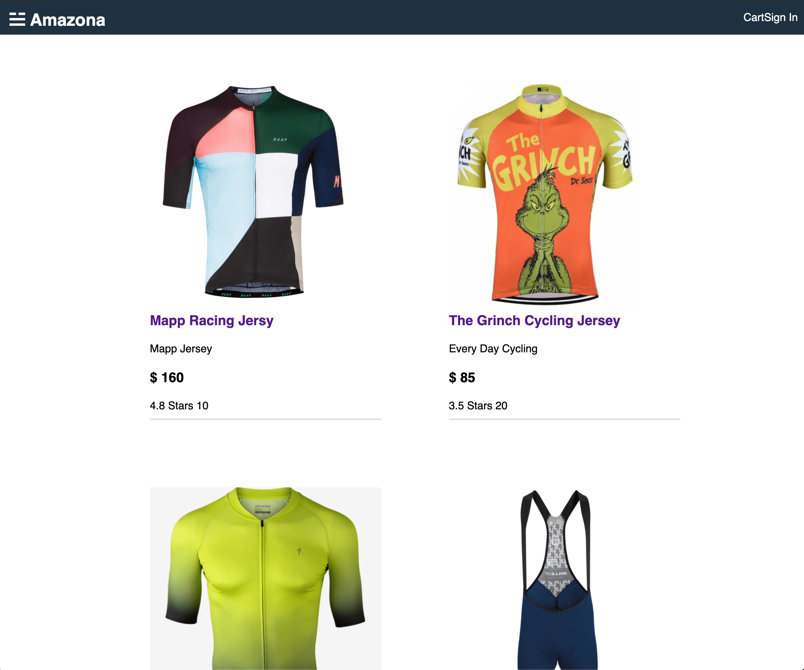

# e-commerce-template
MERN e commerce template to implement into other sites

built with a create-react-app front-end, Express/Node server side, MongoDatabase and Redux for the state management tool. 

   
  <a href="">Amazona e-commerce-template</a> 
   
  

# Description

This app will will provide a base template for future developments on e-commerce platforms. 

# Built with

- JavaScript
- redux
- mongoDB
- Node.js
- Express
- HTML5
- CSS3

# Banter

